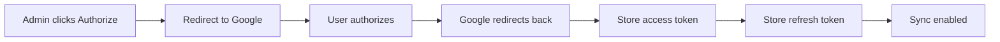

# Feature Implementation Plan - Version 1.2.0

**Target Version:** 1.2.0  
**Current Version:** 1.1.14  
**Type:** Major Feature Release  
**Date:** 2026-01-22

---

## Overview

This document outlines the implementation plan for major new features and improvements to the Antigravity Booking plugin.

---

## Feature List

### 1. OAuth-Based Google Calendar Integration
Replace service account authentication with OAuth 2.0 flow

### 2. Dashboard Sorting
Add sortable columns with toggle between ascending/descending

### 3. Booking Approval Checklist
Track booking requirements with progress bar

### 4. Flexible Overnight Booking Times
Configure different overnight times per day of week + special date overrides

### 5. Blackout Dates Calendar Interface
Visual calendar for selecting blackout dates and ranges

### 6. Blackout Dates in Dashboard
Show blackout periods as entries in dashboard

### 7. Fix Booking Edit Page
Add "Save Changes" button and ensure edits actually save

---

## Feature #1: OAuth Google Calendar Integration

### Current State (Service Account)
- Uses JSON key file
- Complex setup
- Authentication errors
- Doesn't work well with shared hosting

### New State (OAuth)
- "Authorize with Google" button
- Simple one-click setup
- Automatic token refresh
- Better error handling

### Implementation Details

#### 1.1 OAuth Flow Architecture



#### 1.2 Database Changes

**New Options:**
- `antigravity_gcal_oauth_access_token` - Current access token
- `antigravity_gcal_oauth_refresh_token` - Refresh token (encrypted)
- `antigravity_gcal_oauth_expires_at` - Token expiration timestamp
- `antigravity_gcal_oauth_authorized` - Boolean flag

**Remove Options:**
- `antigravity_gcal_credentials_json` - No longer needed
- `antigravity_gcal_credentials_file` - No longer needed

#### 1.3 New Files

**`includes/class-antigravity-booking-google-oauth.php`**
- Handle OAuth authorization flow
- Token refresh logic
- Redirect handling

**`includes/oauth-callback.php`**
- OAuth callback endpoint
- Receives authorization code
- Exchanges for tokens

#### 1.4 Settings Page Changes

**Remove:**
- Service account JSON textarea
- Credentials file path field

**Add:**
- OAuth Client ID field
- OAuth Client Secret field
- "Authorize with Google" button
- Authorization status indicator
- "Disconnect" button

#### 1.5 Google Cloud Console Setup

**Required:**
1. Create OAuth 2.0 credentials (not service account)
2. Add authorized redirect URI: `https://yoursite.com/wp-content/plugins/antigravity-booking/includes/oauth-callback.php`
3. Enable Google Calendar API
4. Copy Client ID and Secret to settings

---

## Feature #2: Dashboard Sorting

### Current State
- Bookings sorted by post date (newest first)
- No user control over sorting

### New State
- Sortable by: Start Date, Customer Name, Cost, Status
- Click column header to sort
- Toggle ascending/descending
- Remember sort preference in session

### Implementation Details

#### 2.1 UI Changes

**Dashboard Table Headers:**
```html
<th class="sortable" data-sort="start_date">
    Start Date 
    <span class="sort-indicator">↕</span>
</th>
```

**Sort Indicators:**
- `↕` - Not sorted
- `↑` - Ascending
- `↓` - Descending

#### 2.2 Query Modifications

**Add to dashboard query:**
```php
$orderby = isset($_GET['orderby']) ? sanitize_text_field($_GET['orderby']) : 'start_date';
$order = isset($_GET['order']) ? sanitize_text_field($_GET['order']) : 'DESC';

if ($orderby === 'start_date') {
    $args['meta_key'] = '_booking_start_datetime';
    $args['orderby'] = 'meta_value';
    $args['order'] = $order;
}
```

#### 2.3 JavaScript

**Add click handlers:**
```javascript
document.querySelectorAll('.sortable').forEach(header => {
    header.addEventListener('click', function() {
        const sort = this.dataset.sort;
        const currentOrder = new URLSearchParams(window.location.search).get('order');
        const newOrder = currentOrder === 'ASC' ? 'DESC' : 'ASC';
        window.location.href = updateQueryParam('orderby', sort, 'order', newOrder);
    });
});
```

---

## Feature #3: Booking Approval Checklist

### Requirements

**Checklist Items:**
1. Rental Agreement
2. Deposit
3. Certificate of Insurance
4. Key Arrangement
5. Deposit Returned

**Features:**
- Checkboxes for each item
- Progress bar showing % complete
- Visible on booking edit page
- Visible in dashboard (compact view)
- Not required for approval (tracking only)

### Implementation Details

#### 3.1 Database Schema

**New Post Meta:**
- `_checklist_rental_agreement` - Boolean (0/1)
- `_checklist_deposit` - Boolean (0/1)
- `_checklist_insurance` - Boolean (0/1)
- `_checklist_key_arrangement` - Boolean (0/1)
- `_checklist_deposit_returned` - Boolean (0/1)
- `_checklist_progress` - Integer (0-100)

#### 3.2 UI Design

**Booking Edit Page - New Meta Box:**
```
┌─────────────────────────────────────┐
│ Booking Approval Checklist          │
├─────────────────────────────────────┤
│ Progress: [████████░░] 80%          │
│                                      │
│ ☑ Rental Agreement                  │
│ ☑ Deposit Received                  │
│ ☑ Certificate of Insurance          │
│ ☑ Key Arrangement                   │
│ ☐ Deposit Returned                  │
│                                      │
│ [Save Checklist]                    │
└─────────────────────────────────────┘
```

**Dashboard List View - New Column:**
```
| Customer | Start Date | Status   | Progress |
|----------|------------|----------|----------|
| John Doe | Jan 25     | Approved | ████░ 80%|
```

#### 3.3 AJAX Handler

**New endpoint:** `wp_ajax_update_booking_checklist`

**Functionality:**
- Receives booking ID and checklist data
- Updates post meta
- Calculates progress percentage
- Returns updated progress

#### 3.4 Progress Calculation

```php
function calculate_checklist_progress($booking_id) {
    $items = array(
        '_checklist_rental_agreement',
        '_checklist_deposit',
        '_checklist_insurance',
        '_checklist_key_arrangement',
        '_checklist_deposit_returned'
    );
    
    $completed = 0;
    foreach ($items as $item) {
        if (get_post_meta($booking_id, $item, true)) {
            $completed++;
        }
    }
    
    return round(($completed / count($items)) * 100);
}
```

---

## Feature #4: Flexible Overnight Booking Times

### Current State
- Overnight: 10PM-10AM (hardcoded)
- Same for all days
- No special date overrides

### New State
- Different times per day of week
- Special date overrides
- Configurable in settings

### Implementation Details

#### 4.1 Database Schema

**New Options:**
```php
'antigravity_booking_overnight_times' => array(
    'monday' => array('start' => '22:00', 'end' => '10:00'),
    'tuesday' => array('start' => '22:00', 'end' => '10:00'),
    'wednesday' => array('start' => '22:00', 'end' => '10:00'),
    'thursday' => array('start' => '22:00', 'end' => '10:00'),
    'friday' => array('start' => '23:00', 'end' => '11:00'), // Different!
    'saturday' => array('start' => '23:00', 'end' => '11:00'),
    'sunday' => array('start' => '22:00', 'end' => '10:00'),
)

'antigravity_booking_special_hours' => array(
    '2026-12-24' => array('start' => '20:00', 'end' => '08:00'), // Christmas Eve
    '2026-12-31' => array('start' => '23:00', 'end' => '12:00'), // New Year's Eve
)
```

#### 4.2 Settings UI

**Overnight Times Section:**
```
┌─────────────────────────────────────────────┐
│ Overnight Booking Times (Per Day)           │
├─────────────────────────────────────────────┤
│ Monday:    [22:00] to [10:00] next day      │
│ Tuesday:   [22:00] to [10:00] next day      │
│ Wednesday: [22:00] to [10:00] next day      │
│ Thursday:  [22:00] to [10:00] next day      │
│ Friday:    [23:00] to [11:00] next day      │
│ Saturday:  [23:00] to [11:00] next day      │
│ Sunday:    [22:00] to [10:00] next day      │
└─────────────────────────────────────────────┘

┌─────────────────────────────────────────────┐
│ Special Date Overrides                      │
├─────────────────────────────────────────────┤
│ Date       | Start Time | End Time | Action │
│ 2026-12-24 | 20:00      | 08:00    | [Del]  │
│ 2026-12-31 | 23:00      | 12:00    | [Del]  │
│                                              │
│ [+ Add Special Date]                        │
└─────────────────────────────────────────────┘
```

#### 4.3 Logic Changes

**Update `Antigravity_Booking_Availability::get_overnight_end()`:**
```php
public static function get_overnight_end($start_datetime) {
    $date = date('Y-m-d', strtotime($start_datetime));
    $day_name = strtolower(date('l', strtotime($start_datetime)));
    
    // Check for special date override first
    $special_hours = get_option('antigravity_booking_special_hours', array());
    if (isset($special_hours[$date])) {
        $end_time = $special_hours[$date]['end'];
        $next_day = date('Y-m-d', strtotime($start_datetime . ' +1 day'));
        return "$next_day $end_time";
    }
    
    // Use day-specific overnight times
    $overnight_times = get_option('antigravity_booking_overnight_times', array());
    if (isset($overnight_times[$day_name])) {
        $end_time = $overnight_times[$day_name]['end'];
        $next_day = date('Y-m-d', strtotime($start_datetime . ' +1 day'));
        return "$next_day $end_time";
    }
    
    // Fallback to default
    $default_end = get_option('antigravity_booking_overnight_extend', '10:00');
    $next_day = date('Y-m-d', strtotime($start_datetime . ' +1 day'));
    return "$next_day $default_end";
}
```

---

## Feature #5: Blackout Dates Calendar Interface

### Current State
- Text area with manual date entry
- Format: YYYY-MM-DD (one per line)
- No visual feedback
- Hard to manage ranges

### New State
- Visual calendar interface
- Click to select dates
- Drag to select ranges
- List of blackout periods
- Easy to add/remove

### Implementation Details

#### 5.1 UI Design

**Settings Page - Blackout Dates Section:**
```
┌─────────────────────────────────────────────┐
│ Blackout Dates                              │
├─────────────────────────────────────────────┤
│ [Visual Calendar - Click to select dates]   │
│                                              │
│  January 2026                                │
│  Su Mo Tu We Th Fr Sa                        │
│      1  2  3  4  5  6                        │
│   7  8  9 10 11 12 13                        │
│  14 15 16 17 18 19 20                        │
│  21 22 23 24 [25][26][27]  <- Selected      │
│  28 29 30 31                                 │
│                                              │
│ [< Prev Month] [Next Month >]               │
│                                              │
│ Selected Blackout Periods:                   │
│ • Jan 25-27, 2026 [Remove]                  │
│ • Dec 24, 2026 [Remove]                     │
│                                              │
│ [Add Date Range Manually]                   │
└─────────────────────────────────────────────┘
```

#### 5.2 Database Schema

**New Custom Post Type:** `blackout_date`

**Post Meta:**
- `_blackout_start_date` - YYYY-MM-DD
- `_blackout_end_date` - YYYY-MM-DD (same as start for single days)
- `_blackout_reason` - Optional text field

**Why Custom Post Type:**
- Easier to manage than serialized array
- Can query efficiently
- Can add metadata later
- Shows in dashboard naturally

#### 5.3 JavaScript Library

**Use Flatpickr** (already included in plugin):
- Range selection mode
- Multiple date selection
- Inline calendar display
- Customizable styling

#### 5.4 AJAX Endpoints

**`wp_ajax_add_blackout_date`**
- Creates new blackout_date post
- Validates date range
- Returns updated list

**`wp_ajax_remove_blackout_date`**
- Deletes blackout_date post
- Returns success

**`wp_ajax_get_blackout_dates`**
- Returns all blackout dates as JSON
- For calendar highlighting

---

## Feature #6: Blackout Dates in Dashboard

### Implementation Details

#### 6.1 Dashboard Integration

**Show blackout dates as entries:**
```
| ID  | Customer      | Start Date | End Date  | Status      |
|-----|---------------|------------|-----------|-------------|
| 123 | John Doe      | Jan 25     | Jan 25    | Approved    |
| -   | [Blackout]    | Jan 26     | Jan 28    | Blacked Out |
| 124 | Jane Smith    | Jan 29     | Jan 29    | Pending     |
```

#### 6.2 Query Modification

**Combine bookings and blackout dates:**
```php
// Get regular bookings
$bookings = new WP_Query(array(
    'post_type' => 'booking',
    // ... existing args
));

// Get blackout dates
$blackouts = new WP_Query(array(
    'post_type' => 'blackout_date',
    'posts_per_page' => -1,
    'meta_query' => array(/* date range filter */)
));

// Merge and sort by date
$all_entries = array_merge($bookings->posts, $blackouts->posts);
usort($all_entries, function($a, $b) {
    $date_a = get_post_meta($a->ID, '_booking_start_datetime', true) 
           ?: get_post_meta($a->ID, '_blackout_start_date', true);
    $date_b = get_post_meta($b->ID, '_booking_start_datetime', true) 
           ?: get_post_meta($b->ID, '_blackout_start_date', true);
    return strcmp($date_a, $date_b);
});
```

#### 6.3 Display Logic

**Blackout entry rendering:**
```php
if ($entry->post_type === 'blackout_date') {
    $start = get_post_meta($entry->ID, '_blackout_start_date', true);
    $end = get_post_meta($entry->ID, '_blackout_end_date', true);
    $reason = get_post_meta($entry->ID, '_blackout_reason', true);
    
    echo '<tr style="background: #fcf0f1;">';
    echo '<td colspan="3">[Blackout Period]</td>';
    echo '<td>' . date('M j, Y', strtotime($start)) . '</td>';
    echo '<td>' . date('M j, Y', strtotime($end)) . '</td>';
    echo '<td>-</td>';
    echo '<td><span style="color: #d63638;">Blacked Out</span></td>';
    echo '<td><button onclick="removeBlackout(' . $entry->ID . ')">Remove</button></td>';
    echo '</tr>';
}
```

---

## Feature #7: Fix Booking Edit Page

### Current Issue
- Edits don't save
- No "Save Changes" button
- Confusing UX

### Root Cause Investigation Needed

**Possible causes:**
1. Missing `save_post` hook
2. Nonce verification failing
3. Autosave interfering
4. Meta box save logic not triggering

### Implementation Plan

#### 7.1 Add Explicit Save Button

**In meta box:**
```php
<p class="submit">
    <input type="submit" name="save_booking" class="button button-primary button-large" value="Save Changes">
</p>
```

#### 7.2 Verify Save Hook

**Check `class-antigravity-booking-cpt.php`:**
```php
add_action('save_post_booking', array($this, 'save_booking_meta'), 10, 2);
```

Ensure this is firing and nonce is valid.

#### 7.3 Add Save Confirmation

**After save:**
```php
add_action('post_updated_messages', array($this, 'booking_updated_messages'));

public function booking_updated_messages($messages) {
    $messages['booking'] = array(
        1 => 'Booking updated successfully.',
        6 => 'Booking created successfully.',
    );
    return $messages;
}
```

---

## Database Schema Summary

### New Custom Post Type

**`blackout_date`**
- `post_title`: "Blackout: [date range]"
- `post_status`: 'publish'
- `post_type`: 'blackout_date'

**Meta Fields:**
- `_blackout_start_date`: YYYY-MM-DD
- `_blackout_end_date`: YYYY-MM-DD
- `_blackout_reason`: Text (optional)

### New Booking Meta Fields

**Checklist:**
- `_checklist_rental_agreement`: Boolean
- `_checklist_deposit`: Boolean
- `_checklist_insurance`: Boolean
- `_checklist_key_arrangement`: Boolean
- `_checklist_deposit_returned`: Boolean
- `_checklist_progress`: Integer (0-100)

### New Options

**OAuth:**
- `antigravity_gcal_oauth_client_id`: String
- `antigravity_gcal_oauth_client_secret`: String (encrypted)
- `antigravity_gcal_oauth_access_token`: String
- `antigravity_gcal_oauth_refresh_token`: String (encrypted)
- `antigravity_gcal_oauth_expires_at`: Timestamp
- `antigravity_gcal_oauth_authorized`: Boolean

**Overnight Times:**
- `antigravity_booking_overnight_times`: Array (per day)
- `antigravity_booking_special_hours`: Array (specific dates)

---

## Implementation Order

### Phase 1: Core Fixes & Improvements
1. Fix booking edit page save functionality
2. Add dashboard sorting
3. Implement booking approval checklist

### Phase 2: Overnight Booking Flexibility
4. Add per-day overnight times configuration
5. Add special date overrides
6. Update availability logic

### Phase 3: Blackout Dates Enhancement
7. Create blackout_date custom post type
8. Build calendar interface
9. Integrate with dashboard
10. Update availability checking

### Phase 4: OAuth Integration
11. Create OAuth handler class
12. Build authorization flow
13. Implement token refresh
14. Update settings page
15. Remove service account code

---

## File Structure Changes

### New Files
```
includes/
├── class-antigravity-booking-google-oauth.php (NEW)
├── class-antigravity-booking-blackout.php (NEW)
├── oauth-callback.php (NEW)
└── ... existing files

admin/
├── js/
│   ├── blackout-calendar.js (NEW)
│   ├── checklist-manager.js (NEW)
│   └── dashboard-sorting.js (NEW)
└── css/
    ├── blackout-calendar.css (NEW)
    └── checklist.css (NEW)
```

### Modified Files
```
includes/
├── class-antigravity-booking.php (load new classes)
├── class-antigravity-booking-cpt.php (add checklist meta box)
├── class-antigravity-booking-dashboard.php (sorting, blackout display)
├── class-antigravity-booking-settings.php (OAuth UI, overnight times)
├── class-antigravity-booking-availability.php (blackout CPT integration)
└── class-antigravity-booking-google-calendar.php (use OAuth tokens)
```

---

## Testing Strategy

### Unit Tests Needed
- OAuth token refresh logic
- Checklist progress calculation
- Overnight time resolution (day-specific + overrides)
- Blackout date range validation
- Dashboard sorting logic

### Integration Tests
- OAuth authorization flow end-to-end
- Booking creation with blackout dates
- Checklist updates via AJAX
- Dashboard with mixed bookings and blackouts

### Manual Testing
- OAuth authorization with Google
- Token refresh after expiration
- Checklist UI on edit page
- Dashboard sorting by each column
- Blackout calendar date selection
- Overnight booking with different times per day

---

## Security Considerations

### OAuth Tokens
- Store refresh token encrypted
- Use WordPress transients for access token
- Validate state parameter in OAuth callback
- Check nonce on all AJAX endpoints

### Checklist Updates
- Verify user has `edit_post` capability
- Validate booking ID exists
- Sanitize all inputs

### Blackout Dates
- Validate date formats
- Ensure end >= start
- Sanitize reason text

---

## Performance Considerations

### Dashboard Query Optimization
- Combine booking and blackout queries
- Use `fields => 'ids'` where possible
- Cache blackout dates (rarely change)
- Limit results with pagination

### OAuth Token Refresh
- Check expiration before each API call
- Refresh proactively (5 min before expiry)
- Cache calendar service object

---

## User Experience Enhancements

### Visual Feedback
- Loading spinners during AJAX
- Success/error messages
- Progress bar animations
- Sortable column indicators

### Accessibility
- ARIA labels on all interactive elements
- Keyboard navigation for calendar
- Screen reader announcements
- Focus management

---

## Migration Strategy

### From v1.1.14 to v1.2.0

**Automatic migrations:**
1. Convert blackout dates from text to CPT
2. Initialize checklist meta for existing bookings (all unchecked)
3. Set default overnight times from current settings

**Manual steps:**
1. Set up OAuth credentials in Google Cloud Console
2. Authorize with Google in settings
3. Review overnight times configuration

---

## Rollback Plan

### If Issues Occur

**Revert to v1.1.14:**
- Blackout dates revert to text field
- Checklist data preserved but not displayed
- OAuth tokens cleared
- Service account can be re-enabled

**Data Safety:**
- All booking data preserved
- Checklist meta fields remain (just hidden)
- Blackout CPT can be deleted without affecting bookings

---

## Success Criteria

### Must Have
- ✅ OAuth authorization works
- ✅ Tokens refresh automatically
- ✅ Dashboard sorting works
- ✅ Checklist saves and displays
- ✅ Overnight times configurable per day
- ✅ Blackout calendar functional
- ✅ Booking edit page saves changes

### Should Have
- ✅ Blackout dates show in dashboard
- ✅ Progress bar animates
- ✅ Special date overrides work
- ✅ All AJAX has loading states

### Nice to Have
- ✅ Keyboard shortcuts for common actions
- ✅ Bulk checklist updates
- ✅ Export includes checklist status

---

## Questions for Clarification

### 1. Checklist Display in Dashboard
You mentioned showing checklist in dashboard. Should it be:
- **Option A:** New column showing progress bar only (80%)
- **Option B:** Expandable row showing all checklist items
- **Option C:** Tooltip on hover showing checklist status

### 2. Blackout Date Reasons
Should blackout dates have a "reason" field?
- Example: "Holiday", "Maintenance", "Private Event"
- Displayed in dashboard?

### 3. Special Date Overrides
Should special date overrides apply to:
- **Option A:** Only overnight bookings
- **Option B:** All bookings (business hours too)

### 4. OAuth Scope
Should OAuth request:
- **Option A:** Calendar read/write only
- **Option B:** Calendar + Gmail (for better email integration)

---

## Estimated Timeline

| Feature | Complexity | Time |
|---------|------------|------|
| Fix booking edit page | Low | 1 hour |
| Dashboard sorting | Low | 2 hours |
| Booking checklist | Medium | 4 hours |
| Overnight times per day | Medium | 3 hours |
| Special date overrides | Low | 2 hours |
| Blackout calendar UI | High | 6 hours |
| Blackout CPT integration | Medium | 4 hours |
| OAuth implementation | High | 8 hours |
| Testing & debugging | - | 6 hours |
| **Total** | | **36 hours** |

---

## Next Steps

1. **Review this plan** and provide feedback
2. **Answer clarification questions** above
3. **Approve implementation** approach
4. **Switch to Code mode** to begin implementation

---

**Plan Status:** Draft - Awaiting Approval  
**Version Target:** 1.2.0  
**Breaking Changes:** None (all backward compatible)
